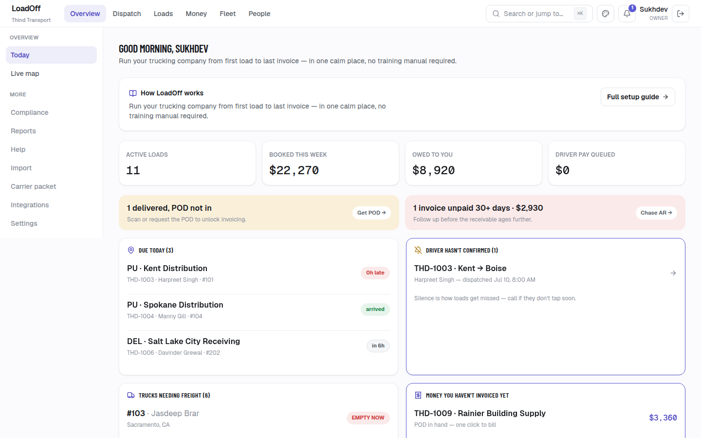
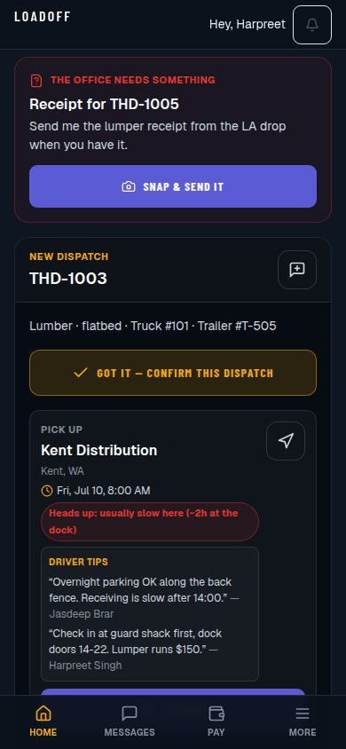
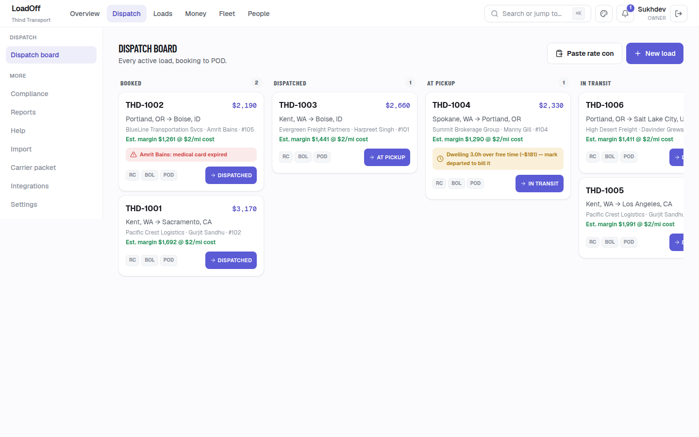

# LoadOff + Thind Transport

**Live:** [thindtransport.com](https://thindtransport.com) · **TMS:** [/hub](https://thindtransport.com/hub) · **Product:** [/loadoff](https://thindtransport.com/loadoff)

One monorepo for a Kent, WA family carrier:

1. **LoadOff** (`/hub`) — multi-tenant TMS: dispatch, invoicing, settlements, fuel + IFTA, compliance, customer portals, and an installable driver PWA. Thind Transport is tenant #1. (Older docs may still say HaulDesk.)
2. **Driver recruitment site** (`/`) — marketing + apply flows that convert CDL drivers into applications.

| | |
|---|---|
|  |  |
| Today: loads due, unconfirmed drivers, money not yet invoiced | Driver PWA: offline shell, status taps, camera PODs |



## Why this repo matters for Claude / AI work

- **Anthropic Claude in production** — Smart Setup document extraction via the Messages API (`src/lib/hub/doc-intake/llm-parser.ts`): PII redaction, confidence-scored fields, human review, and a heuristic fallback when `ANTHROPIC_API_KEY` is unset.
- **Hard invariants** — carrier-scoped queries, integer-cent money math, server-action permissions, audit logs, automated tests.
- **Honest delivery** — Cursor / Claude accelerate the build; humans review, test, and own what ships. Some vendor integrations are stub-first (mock + contract tests) until credentials are live; CSV/manual fallbacks stay available.
- **Demo path** — [`docs/demo-script.md`](docs/demo-script.md)

## What LoadOff covers

- **Today** — what's due, who hasn't confirmed, missing PODs, money not yet invoiced
- **Dispatch** — week planner, board, live map when ELD is connected
- **Money** — rate confirmation → invoice → payment → pay-rules settlements
- **Fuel + IFTA** — card feeds or CSV → MPG, costing, IFTA quarters
- **Compliance** — expiries, DOT accident register, authority checks
- **Driver app** — confirm, status, camera PODs, chat, pay stubs, DVIR, offline shell
- **Integrations** — ELD, fuel cards, load boards, mailbox, QuickBooks (registry + encrypted credentials)

## Quick start

```bash
npm install
cp .env.example .env.local    # POSTGRES_URL + NEXTAUTH_SECRET minimum
npm run db:migrate
npm run seed:demo             # optional
npm run dev                   # http://localhost:3000  (hub at /hub)
```

## Useful commands

| Command | Purpose |
|---|---|
| `npm test` | Vitest suite |
| `npm run build` | Production build |
| `npm run connections:check` | Integration / env readiness |
| `npm run db:migrate` | Apply `migrations/hub/*.sql` |

## Stack

Next.js (App Router), TypeScript, Tailwind, NextAuth v5, Postgres, pdf-lib, web-push. Deployed on Vercel. Optional Go / Rust sidecars; TypeScript path works alone when they are unset.

## License

© Thind Transport. All rights reserved.
