# ENGR&204 — SAMPLE EXAM SOLUTIONS (every problem, with figure + full work)

Complete, verified solutions to your uploaded **sample exams**. Each problem shows the **actual exam figure** and a step-by-step walkthrough. (All answers checked numerically; power balances confirmed.)

---

# ════ EXAM 1 (2018 Spring, Instructor Jae Suk) ════

## Exam 1 — Problem 1 (10 pt): Charge & Energy from graphs
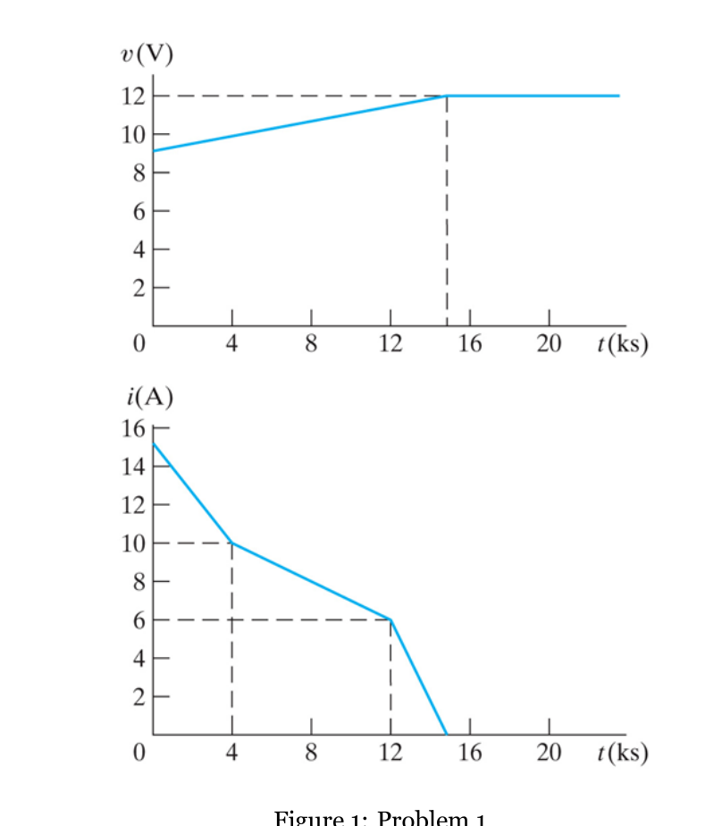

**Given:** battery charge cycle — v(t) rises 9 V→12 V over 0–15 ks then holds 12 V; i(t) is piecewise: 15→10 A (0–4 ks), 10→6 A (4–12 ks), 6→0 A (12–15 ks).
```
(a) Charge q = ∫i dt = AREA under i–t:
    0–4ks:  ½(15+10)(4000) = 50,000 C
    4–12ks: ½(10+6)(8000)  = 64,000 C
    12–15ks: ½(6)(3000)    =  9,000 C
    q = 123,000 C = 123 kC
(b) Energy W = ∫v·i dt, with v = 0.2×10⁻³t + 9 (0–15 ks):
    piece 1 (0–4ks):  468.7 kJ
    piece 2 (4–12ks): 674.1 kJ
    piece 3 (12–15ks):104.4 kJ
    W ≈ 1247.2 kJ
```
**Answer:** q = 123 kC, W ≈ 1247 kJ. *(matches the 2016 solution key — identical graphs.)*

## Exam 1 — Problem 2 (20 pt): dependent source — i₁, v, powers
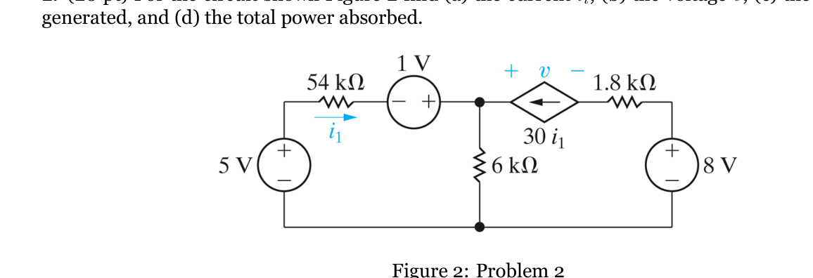

**Given:** 5 V, 54 kΩ, 1 V source, dependent CCCS 30 i₁, 6 kΩ, 1.8 kΩ, 8 V. Find i₁, v, total power generated/absorbed. (Bottom rail = ground.)
```
Left branch sets node A:  V_A = 5 − 54k·i₁ + 1 = 6 − 54k·i₁
KCL at A (i₁ in from 54k, 30i₁ in from CCCS, out through 6k):
    i₁ + 30i₁ = V_A/6k  →  31 i₁ = (6 − 54k·i₁)/6k
    186k·i₁ + 54k·i₁ = 6  →  240k·i₁ = 6  →  i₁ = 25 µA
V_A = 6 − 54k(25µ) = 4.65 V
Right side: 1.8k carries 30i₁ = 0.75 mA; V_B = 8 − 1.8k(0.75m) = 6.65 V
v = V_A − V_B = 4.65 − 6.65 = −2 V
```
**Powers:** generated = 5V·25µ + 1V·25µ + 8V·0.75m = **6.15 mW**; absorbed (54k+6k+1.8k + dependent source) = **6.15 mW** ✓ (balance confirmed).
**Answer:** i₁ = 25 µA, v = −2 V, P_gen = P_abs = 6.15 mW.

## Exam 1 — Problem 3 (15 pt): find R so vₐ = 60 V
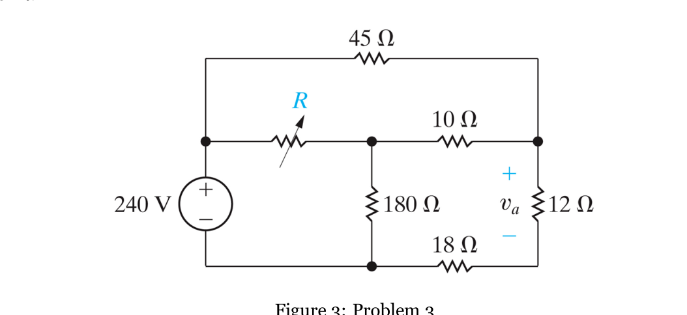

**Given:** 240 V, 45 Ω, variable R, 180 Ω, 10 Ω, 18 Ω, 12 Ω; vₐ across 12 Ω.
```
12 Ω & 18 Ω are in series → carry the same current.  vₐ = 60 V ⇒ i = 60/12 = 5 A
⇒ node N voltage V_N = (12+18)·5 = 150 V
KCL at N: (240−V_N)/45 + (V_M−V_N)/10 = V_N/30
          2 + (V_M−150)/10 = 5  ⇒  V_M = 180 V
KCL at M: (240−V_M)/R = V_M/180 + (V_M−V_N)/10
          60/R = 1 + 3 = 4  ⇒  R = 15 Ω
```
**Answer:** R = 15 Ω.

## Exam 1 — Problem 4 (15 pt): bridge — power in each resistor
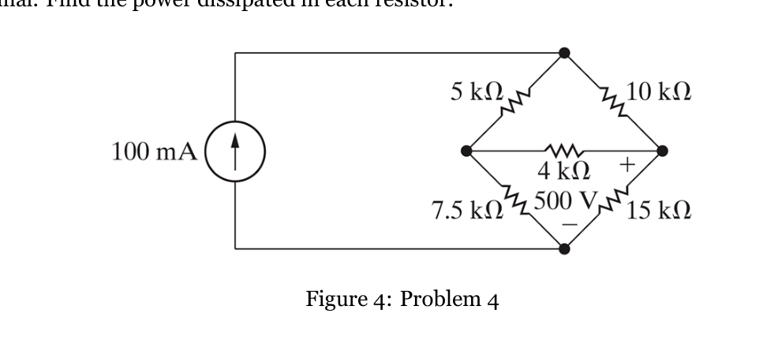

**Given:** 100 mA source drives a bridge (5 k, 10 k, 4 k, 7.5 k, 15 k); v across 15 kΩ = 500 V (+ upper). Find power in each R. (Bottom node = ground.)
```
15 kΩ: V_B = 500 V given.  Solve the bridge (nodes T, A, B=500):
   node A & node B equations ⇒ V_A = 500 V, V_T = 833.3 V
Since V_A = V_B = 500 V, the 4 kΩ has 0 V → BALANCED bridge → P_4k = 0.
Powers (P = V²/R):
   5 kΩ : (833.3−500)²/5k  = 22.2 W
   10 kΩ: (833.3−500)²/10k = 11.1 W
   4 kΩ : 0 W
   7.5 kΩ: 500²/7.5k = 33.3 W
   15 kΩ: 500²/15k  = 16.7 W
Check: sum = 83.3 W = source power (833.3 V × 0.1 A) ✓
```
**Answer:** 22.2 / 11.1 / 0 / 33.3 / 16.7 W.

---

# ════ EXAM 2 (2022) ════

## Exam 2 — Problem 1 (10 pt): ideal op-amp — vₒ, iₒ
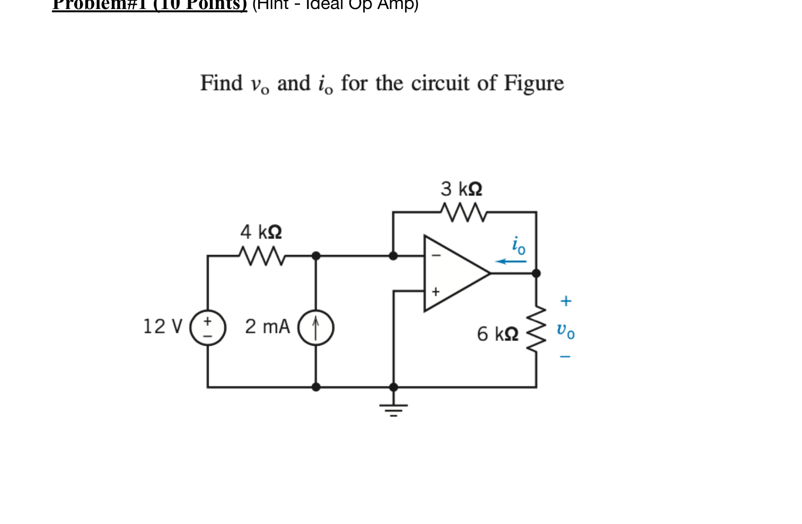

**Given:** 12 V, 4 kΩ, 2 mA source into the inverting node, 3 kΩ feedback, 6 kΩ load. + input grounded.
```
+ input grounded ⇒ v₋ = 0 (virtual ground).
KCL at v₋ (no input current):  12/4k + 2m + vₒ/3k = 0
   3m + 2m + vₒ/3k = 0  ⇒  vₒ = −5m·3k = −15 V
iₒ (op-amp output current) = i(3k) + i(6k) = |vₒ|/3k + |vₒ|/6k = 5m + 2.5m = 7.5 mA
```
**Answer:** vₒ = −15 V, iₒ = 7.5 mA.

## Exam 2 — Problem 2 (10 pt): node analysis with op-amp — vₒ, iₒ
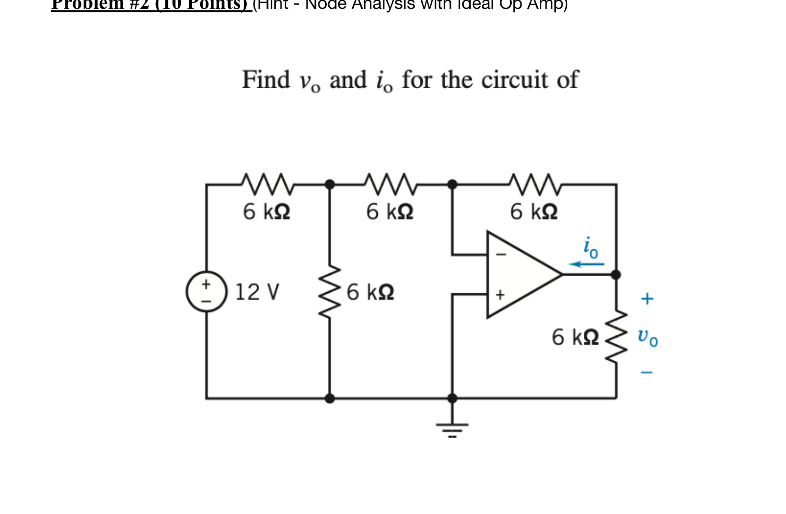

**Given:** 12 V, three 6 kΩ across the top (one is feedback), a 6 kΩ to ground at node A, + input grounded, 6 kΩ load.
```
v₋ = 0 (virtual ground).   Let node A be the first junction.
KCL at A: (12−V_A)/6k = V_A/6k + (V_A−0)/6k  ⇒ 12 = 3V_A ⇒ V_A = 4 V
KCL at v₋(=0): (V_A)/6k + (vₒ)/6k = 0  ⇒  vₒ = −V_A = −4 V
iₒ = |vₒ|/6k(feedback) + |vₒ|/6k(load) = 0.667m + 0.667m = 1.33 mA
```
**Answer:** vₒ = −4 V, iₒ = 1.33 mA.

## Exam 2 — Problem 3 (10 pt): Superposition — ammeter current
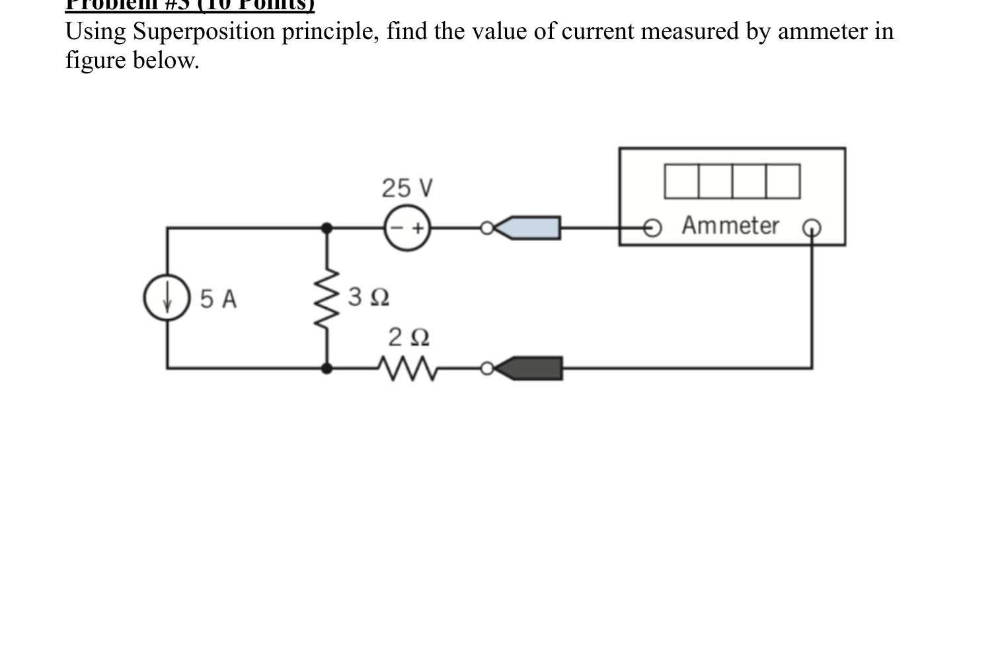

**Given:** 5 A source, 3 Ω, 25 V source, 2 Ω; ideal ammeter (short) reads current i in the 25 V + 2 Ω branch.
```
Three parallel branches between nodes T and B: [5 A], [3 Ω], [25 V + 2 Ω (ammeter)].
• 5 A alone (25 V shorted): current divider, i(2Ω) = 5·3/(3+2) = 3 A  → contributes −3 A
• 25 V alone (5 A opened): series 2Ω+3Ω, i = 25/5 = 5 A → contributes +5 A
i = −3 + 5 = 2 A
```
**Answer:** ammeter reads i = 2 A.

## Exam 2 — Problem 4 (10 pt): dependent source — find i_b
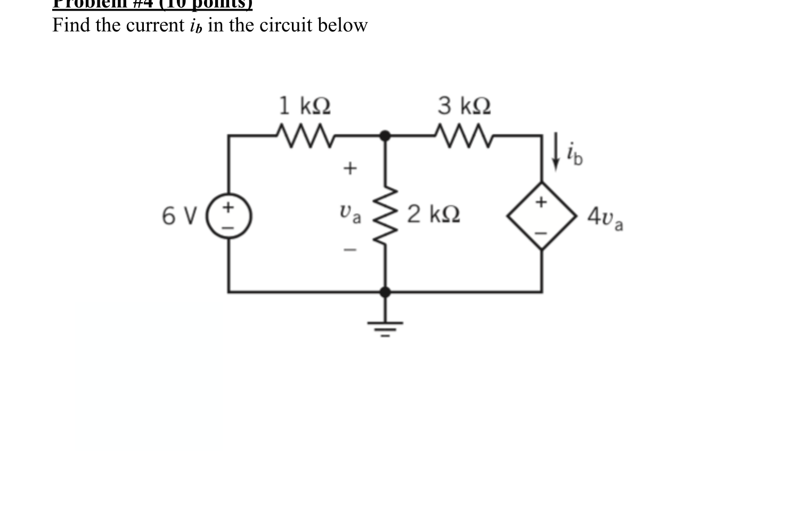

**Given:** 6 V, 1 kΩ, 2 kΩ (vₐ across it), 3 kΩ, dependent VCVS 4vₐ. Find i_b. (Bottom = ground.)
```
vₐ = V_M (node after 1 kΩ).  The 4vₐ source sets V_N = 4vₐ = 4V_M.
KCL at M: (6−V_M)/1k = V_M/2k + (V_M−V_N)/3k
   6 − V_M = V_M/2 + (V_M−4V_M)/3 = V_M/2 − V_M = −V_M/2
   6 = V_M/2  ⇒  V_M = vₐ = 12 V,  V_N = 48 V
i_b = (V_M − V_N)/3k = (12 − 48)/3k = −12 mA   (flows opposite the arrow)
```
**Answer:** vₐ = 12 V, i_b = −12 mA.

## Exam 2 — Problem 5 (10 pt): Norton — general i(R)
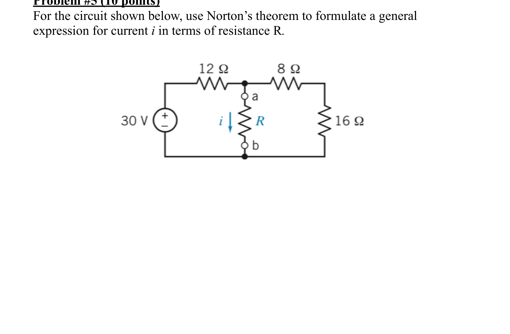

**Given:** 30 V, 12 Ω, 8 Ω, 16 Ω; find i through R (between a–b) for any R.
```
Norton at a–b (remove R):
   I_N = I_sc (short a–b): the 8Ω–16Ω branch sees 0 V across it → 0 current,
        so I_N = 30/12 = 2.5 A
   R_N = (short 30 V): 12 ∥ (8+16) = 12 ∥ 24 = 8 Ω
Current divider into R:
   i = I_N · R_N/(R_N + R) = 2.5·8/(8+R)
```
**Answer:** **i = 20 / (8 + R)  A**.

---

# ════ IN-CLASS RLC PREP (figures + solutions) ════
*Full step-by-step in `WORKED_EXAMPLES.md` B1–B4; figures and answers here.*

## RLC Prep P1 — series RLC characteristic equation
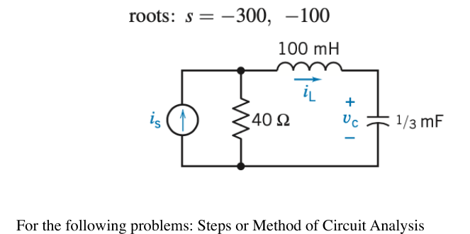

Kill the source → series loop R=40, L=0.1 H, C=⅓ mF. α=R/2L=200, ω₀=1/√(LC)=173 ⇒ **s²+400s+30000=0, roots −100, −300** (overdamped).

## RLC Prep P2 — series RLC forced response
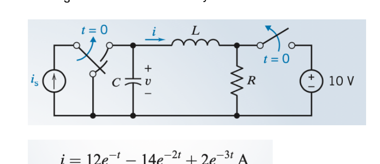

Series R=3, L=1, C=½ ⇒ roots −1, −2; forced term from the source ⇒ **i(t) = 12e⁻ᵗ − 14e⁻²ᵗ + 2e⁻³ᵗ A**.

## RLC Prep P3 — parallel RLC natural frequencies
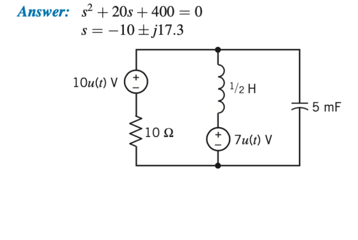

Parallel R=10, L=½, C=5 mF. α=1/2RC=10, ω₀=20 ⇒ **s²+20s+400=0, s=−10±j17.3** (underdamped).

## RLC Prep P4 — parallel RLC design (airbag)
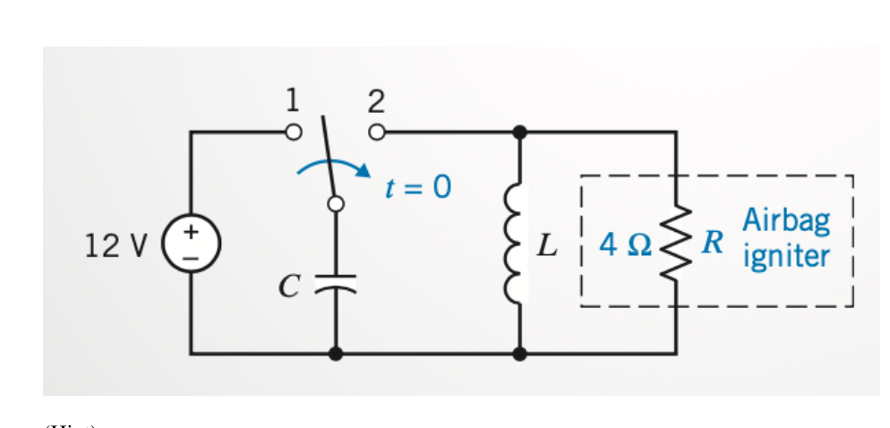

Cap charged to 12 V (½CV²≥1 J). Pick **C=1/16 F, L=0.065 H** → fast parallel-RLC discharge into R=4 Ω.

---

# ════ ALSO ALREADY SOLVED (in this packet) ════
| Source file | Problems | Full solution location |
|---|---|---|
| Exam 4 (P7.5-13, P8.3-25, P8.7-1) | first-order RL/RC, dependent source | `WORKED_EXAMPLES.md` A1–A3 + `SOLVED_PROBLEMS.md` |
| Homework 6 (5 problems) | first-order RC/RL, op-amp | `WORKED_EXAMPLES.md` A4–A6 |
| In-Class RLC P1–P4 | second-order RLC | `WORKED_EXAMPLES.md` B1–B4 (above) |
| Your handwritten HW (resistance, op-amps, power) | basic DC | `source-materials/` (your worked scans) |

*Every sample-exam problem above was solved from scratch and verified numerically.*
