# ENGR&204 — SOLVED PROBLEMS BANK (diagram + walkthrough for every type)

Each problem below has a **circuit diagram with real numbers** and an **easy-to-read step-by-step solution**. Find the one that looks like your exam problem and follow the same steps with your numbers. Ordered **basic → complex**.

---

# ░░ BASIC ░░

## S1 — Ohm's Law & Power
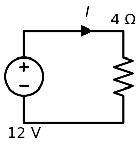

**Given:** 12 V across a 4 Ω resistor. Find I and power.
```
I = V/R = 12/4 = 3 A
P = V·I = 12·3 = 36 W        (check: I²R = 3²·4 = 36 W ✓)
```
**Answer:** I = 3 A, P = 36 W.

## S2 — Series resistors & Voltage Divider
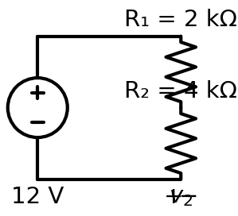

**Given:** 12 V, R₁ = 2 kΩ in series with R₂ = 4 kΩ. Find v₂.
```
Same current: I = V/(R₁+R₂) = 12/(6 kΩ) = 2 mA
Divider:  v₂ = V·R₂/(R₁+R₂) = 12·4/6 = 8 V     (v₁ = 4 V)
```
**Answer:** v₂ = 8 V.

## S3 — Parallel resistors & Current Divider
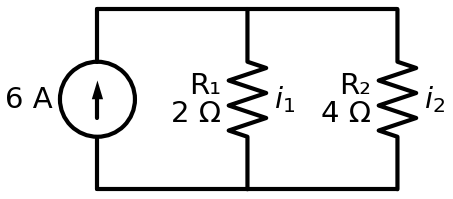

**Given:** 6 A into R₁ = 2 Ω ∥ R₂ = 4 Ω. Find i₁, i₂.
```
Current divider (current favors the SMALLER R):
   i₁ = 6·R₂/(R₁+R₂) = 6·4/6 = 4 A
   i₂ = 6·R₁/(R₁+R₂) = 6·2/6 = 2 A          (check 4+2 = 6 ✓)
```
**Answer:** i₁ = 4 A, i₂ = 2 A.

## S4 — KCL at a node
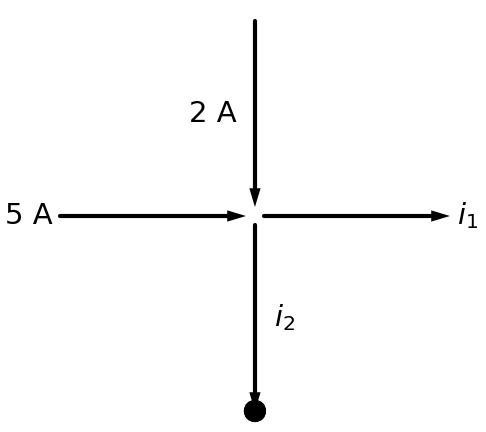

**Given:** 5 A and 2 A flow in; i₁ and i₂ flow out; i₁ measured = 3 A. Find i₂.
```
KCL:  Σ in = Σ out  →  5 + 2 = i₁ + i₂  →  7 = 3 + i₂  →  i₂ = 4 A
```
**Answer:** i₂ = 4 A.

## S5 — Equivalent Resistance (series–parallel reduction)
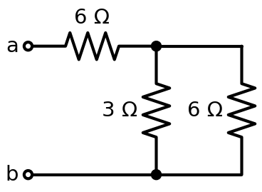

**Given:** 6 Ω in series with (3 Ω ∥ 6 Ω). Find R_ab.
```
Parallel first:  3∥6 = (3·6)/(3+6) = 2 Ω
Then series:     R_ab = 6 + 2 = 8 Ω
```
**Answer:** R_ab = 8 Ω.

## S6 — Capacitor stored charge & energy
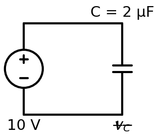

**Given:** C = 2 µF charged to 10 V.
```
Charge:  q = C·V = 2µ·10 = 20 µC
Energy:  W = ½C·V² = ½·2µ·10² = 100 µJ
(DC steady state: a capacitor is an OPEN circuit — no current through it.)
```
**Answer:** q = 20 µC, W = 100 µJ.

---

# ░░ INTERMEDIATE (DC network analysis) ░░

## S7 — Nodal Analysis
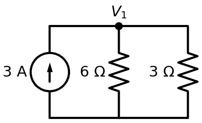

**Given:** 3 A source feeding node V₁ with 6 Ω and 3 Ω to ground. Find V₁.
```
KCL at V₁ (currents leaving = source in):
   V₁/6 + V₁/3 = 3   →   V₁(1/6 + 1/3) = 3   →   V₁·(1/2) = 3   →   V₁ = 6 V
Branch currents: 6Ω → 1 A, 3Ω → 2 A  (sum = 3 A ✓)
```
**Answer:** V₁ = 6 V.

## S8 — Mesh Analysis
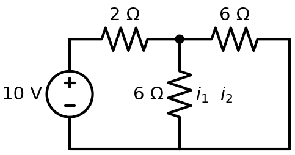

**Given:** 10 V, R₁ = 2 Ω (mesh 1), shared 6 Ω, R₃ = 6 Ω (mesh 2). Find mesh currents.
```
Mesh 1:  −10 + 2·i₁ + 6(i₁ − i₂) = 0   →   8i₁ − 6i₂ = 10
Mesh 2:  6(i₂ − i₁) + 6·i₂ = 0          →   −6i₁ + 12i₂ = 0  →  i₂ = ½ i₁
Substitute:  8i₁ − 3i₁ = 10  →  5i₁ = 10  →  i₁ = 2 A,  i₂ = 1 A
```
**Answer:** i₁ = 2 A, i₂ = 1 A.

## S9 — Superposition
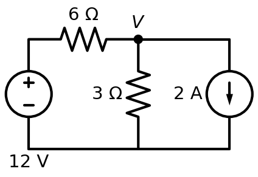

**Given:** 12 V (via 6 Ω) and a 2 A source share node V across 3 Ω. Find V.
```
ONE source at a time:
• 12 V only (open the 2 A source):  V_a = 12·3/(6+3) = 4 V
• 2 A only (short the 12 V source): 6∥3 = 2 Ω,  V_b = 2·2 = 4 V
Add:  V = V_a + V_b = 4 + 4 = 8 V       (check by nodal: (V−12)/6 + V/3 = 2 ✓)
```
**Answer:** V = 8 V.

## S10 — Thévenin Equivalent
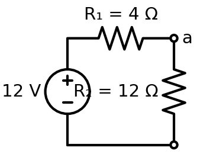

**Given:** 12 V, R₁ = 4 Ω, internal R₂ = 12 Ω. Find Thévenin at a–b.
```
V_th = V_oc = voltage across R₂ = 12·12/(4+12) = 9 V
R_th = (short the 12 V source) R₁ ∥ R₂ = 4∥12 = 3 Ω
```
**Answer:** V_th = 9 V, R_th = 3 Ω.

## S11 — Norton Equivalent (same circuit as S10)


```
I_N = I_sc (short a–b): the 12 Ω is shorted, so I_sc = 12 V / 4 Ω = 3 A
R_N = R_th = 3 Ω
Check: I_N = V_th/R_th = 9/3 = 3 A ✓   (Norton ⇄ Thévenin)
```
**Answer:** I_N = 3 A, R_N = 3 Ω.

## S12 — Maximum Power Transfer
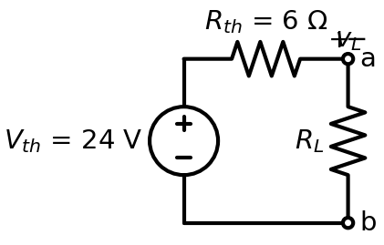

**Given:** V_th = 24 V, R_th = 6 Ω. Find R_L and P_max.
```
Max power when  R_L = R_th = 6 Ω
P_max = V_th²/(4·R_th) = 24²/(4·6) = 576/24 = 24 W
```
**Answer:** R_L = 6 Ω, P_max = 24 W.

## S13 — Inverting Op-Amp
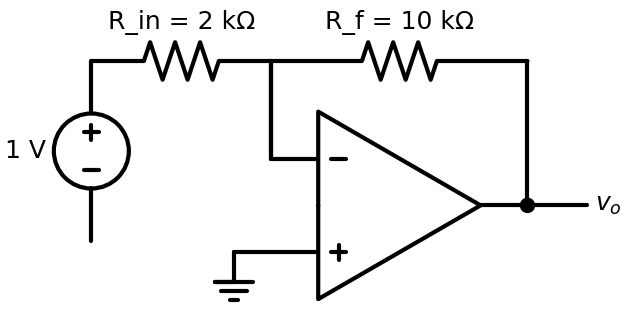

**Given:** R_in = 2 kΩ, R_f = 10 kΩ, v_in = 1 V.
```
v_o = −(R_f/R_in)·v_in = −(10/2)·1 = −5 V
```
**Answer:** v_o = −5 V.

## S14 — Non-Inverting Op-Amp
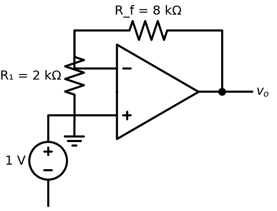

**Given:** R₁ = 2 kΩ, R_f = 8 kΩ, v_in = 1 V.
```
v_o = (1 + R_f/R₁)·v_in = (1 + 8/2)·1 = 5 V
```
**Answer:** v_o = 5 V.

---

# ░░ FIRST-ORDER TRANSIENTS (core of the final) ░░

> Every one uses: **x(t) = x(∞) + [x(0⁺) − x(∞)]·e^(−t/τ)**.

## S15 — RC Charging
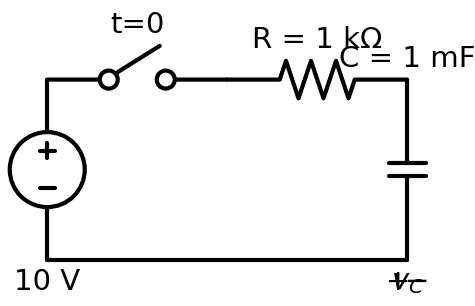

**Given:** 10 V, switch closes at t=0, R = 1 kΩ, C = 1 mF. Find v_C(t).
```
x(0⁺): cap uncharged → v_C(0⁺) = 0 V
x(∞):  cap = open at DC → v_C(∞) = 10 V
τ = R·C = 1000·0.001 = 1 s
v_C(t) = 10 + (0 − 10)e^(−t/1) = 10(1 − e^(−t)) V
i(t)   = (10/1k)e^(−t) = 10 e^(−t) mA
```
**Answer:** v_C(t) = 10(1 − e^(−t)) V.

## S16 — RC Discharging (source-free)
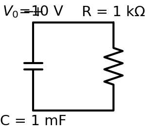

**Given:** C = 1 mF charged to V₀ = 10 V, discharges through R = 1 kΩ. Find v_C(t).
```
x(0⁺) = 10 V,  x(∞) = 0 (no source),  τ = RC = 1 s
v_C(t) = 10 e^(−t) V        (pure decay)
```
**Answer:** v_C(t) = 10 e^(−t) V.

## S17 — RL Step Response
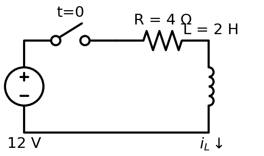

**Given:** 12 V, switch at t=0, R = 4 Ω, L = 2 H. Find i_L(t).
```
x(0⁺): inductor carried 0 before → i_L(0⁺) = 0 A
x(∞):  inductor = short at DC → i_L(∞) = 12/4 = 3 A
τ = L/R = 2/4 = 0.5 s   (so 1/τ = 2)
i_L(t) = 3 + (0 − 3)e^(−t/0.5) = 3(1 − e^(−2t)) A
v_L(t) = L·di/dt = 12 e^(−2t) V
```
**Answer:** i_L(t) = 3(1 − e^(−2t)) A.

## S18 — First-order with a DEPENDENT source
*(diagram & full work: `WORKED_EXAMPLES.md` A3 — Dorf P8.7-1)*
```
Method: can't use τ=RC blindly. Derive the ODE  dv/dt + a·v = forcing,
then v = (natural e^(−at)) + (forced, matching the source).
Result:  v_C(t) = 4 e^(−9t) + 18 e^(−5t) V.
```

---

# ░░ SECOND-ORDER RLC (heavily tested) ░░

## S19 — Series RLC: characteristic equation, roots, complete response
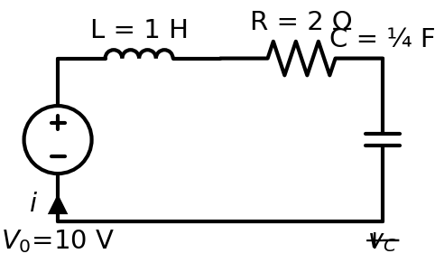

**Given:** source-free series, R = 2 Ω, L = 1 H, C = ¼ F, with i(0) = 0 and v_C(0) = 10 V.
```
α = R/(2L) = 2/2 = 1
ω₀ = 1/√(LC) = 1/√(1·0.25) = 2
α < ω₀  ⇒ UNDERDAMPED;  ω_d = √(ω₀²−α²) = √3 = 1.732
Form:  i(t) = e^(−t)(B₁cos1.732t + B₂sin1.732t)
IC 1:  i(0) = B₁ = 0
IC 2 (from KVL): di/dt(0) = (−R·i(0) − v_C(0))/L = −10
       ⇒ ω_d·B₂ = −10 ⇒ B₂ = −5.77
```
**Answer:** i(t) = −5.77 e^(−t) sin(1.732t) A.

## S20 — Parallel RLC: characteristic equation & natural frequencies
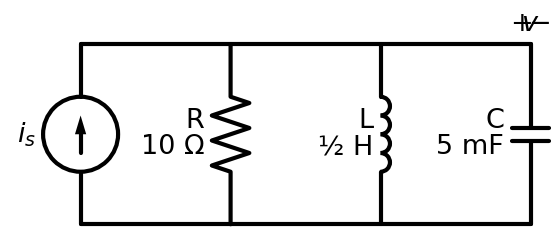

**Given:** parallel R = 10 Ω, L = ½ H, C = 5 mF (after killing sources).
```
α = 1/(2RC) = 1/(2·10·0.005) = 10
ω₀ = 1/√(LC) = 1/√(0.5·0.005) = 20
Characteristic:  s² + (1/RC)s + 1/LC = s² + 20s + 400 = 0
Roots: s = −10 ± √(100−400) = −10 ± j17.3   ⇒ UNDERDAMPED
```
**Answer:** s² + 20s + 400 = 0, s = −10 ± j17.3.

> **Series vs parallel:** only Step-1 differs — series α = R/2L, parallel α = 1/2RC. Same ω₀, same case logic.

---

# ░░ AC STEADY-STATE & POWER (possible Q) ░░

## S21 — Phasor analysis
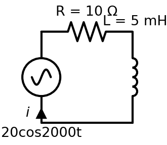

**Given:** v(t) = 20cos(2000t) V, R = 10 Ω in series with L = 5 mH. Find i(t).
```
Z_L = jωL = j(2000)(0.005) = j10 Ω
Z = 10 + j10 = 14.14∠45° Ω
I = V/Z = 20∠0° / 14.14∠45° = 1.414∠−45° A
i(t) = 1.414 cos(2000t − 45°) A   (lags → inductive)
```
**Answer:** i(t) = 1.414 cos(2000t − 45°) A.

## S22 — AC Power & Power-Factor Correction


**Given:** load P = 1000 W, pf = 0.7 lagging, V_rms = 120 V, 60 Hz. Correct to pf = 0.95; find C.
```
θ_old = cos⁻¹0.7 = 45.6°,  tan = 1.020       θ_new = cos⁻¹0.95 = 18.2°, tan = 0.329
Q_C = P(tanθ_old − tanθ_new) = 1000(1.020 − 0.329) = 691 VAR
C = Q_C/(ωV²) = 691/(2π·60·120²) = 127 µF
Also:  P = V_rms I_rms cosθ,  Q = V_rms I_rms sinθ,  S = √(P²+Q²),  pf = P/S
```
**Answer:** add C ≈ 127 µF in parallel.

---

# ░░ EXTRA TOOLS ░░

## S23 — Delta–Wye (Δ→Y) conversion
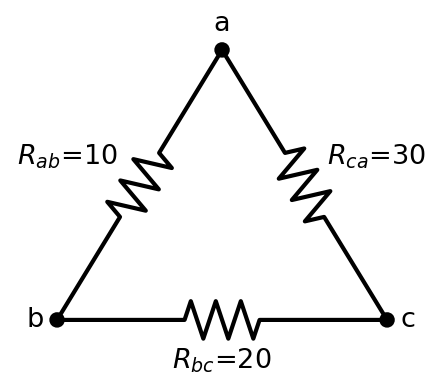

**Given:** Δ with R_ab = 10, R_bc = 20, R_ca = 30 Ω (sum = 60). Convert to Y.
```
R_a = R_ab·R_ca / Σ = (10·30)/60 = 5 Ω
R_b = R_ab·R_bc / Σ = (10·20)/60 = 3.33 Ω
R_c = R_bc·R_ca / Σ = (20·30)/60 = 10 Ω
(now the network is plain series/parallel)
```
**Answer:** R_a = 5 Ω, R_b = 3.33 Ω, R_c = 10 Ω.

## S24 — Charge & Energy from a v–i graph (Exam-1 style)
```
q = ∫ i dt = AREA under the current–time graph
W = ∫ p dt = ∫ v·i dt
Method: split the graph into straight-line segments; on each, write v(t) and i(t);
        form p = v·i; integrate each piece; add. (See EX1_Sol: total ≈ 1247 kJ.)
```

---

*Every diagram is drawn with the exact numbers used in its walkthrough, and every numeric answer here was verified. Match your exam problem to the closest S#, then reuse the steps with your values. Deeper algebra: `WORKED_EXAMPLES.md`. All formulas: `CHEATSHEET.md`.*
