# ENGR&204 — VISUAL GUIDE: match the picture, copy the template

**How to use this on the exam (3 steps):**
1. **Look** at your exam circuit → find the picture below that matches it.
2. **Copy** that template line-by-line, filling the blanks `____` with your numbers.
3. **Check** your answer's shape against the curve picture.

**First, count the energy-storage elements (capacitors + inductors):**

```
 0 caps/inductors  →  DC problem      →  use TYPE 5/6 (nodal, mesh, Thévenin, op-amp)
 1 cap OR 1 inductor → FIRST-ORDER    →  use TYPE 1 (RC) or TYPE 2 (RL)  ← most of your exam
 1 cap AND 1 inductor → SECOND-ORDER  →  use TYPE 3 (series RLC) or TYPE 4 (parallel RLC)
```

---

## THE ONE FORMULA you use for every first-order problem

```
  x(t) = x(∞) + [ x(0⁺) − x(∞) ] · e^( − t / τ )
         └ final ┘  └initial┘ └final┘        └ time constant ┘
```
`x` = the v(t) or i(t) you're asked for. You only ever need **3 numbers**: `x(0⁺)`, `x(∞)`, `τ`.

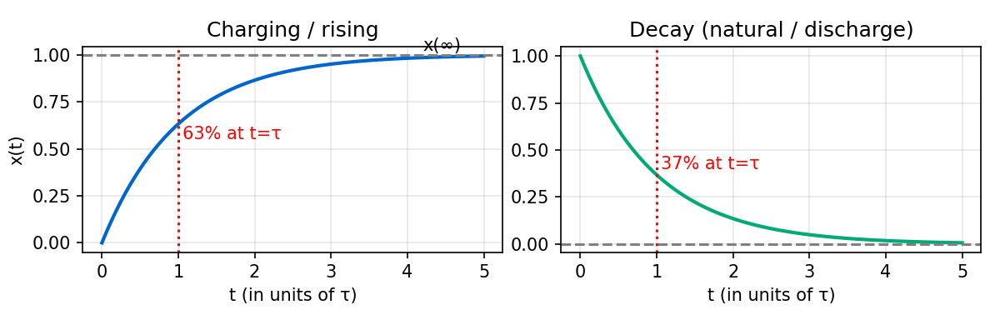

*Left = answer rises to a final value (charging). Right = answer decays to 0 (natural/discharge). After 1τ you've moved 63% of the way; after 5τ it's basically done.*

---

## TYPE 1 — FIRST-ORDER **RC** (one capacitor)

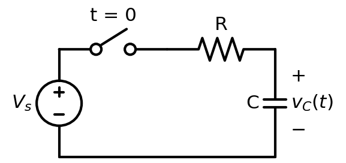

**Recognize it:** a **capacitor**, a switch, resistors, a DC source. Asked for `v_C(t)` or `v(t)`.

**COPY THIS TEMPLATE (fill the blanks):**
```
STEP 1  t<0 (before switch): capacitor = OPEN. Solve DC for the cap voltage.
        v_C(0⁻) = ______        →  v_C(0⁺) = v_C(0⁻) = ______   (cap voltage can't jump)

STEP 2  t→∞ (after switch settles): capacitor = OPEN. Solve DC again.
        v_C(∞) = ______

STEP 3  Time constant: turn OFF independent sources (V-source→wire, I-source→gap).
        Look into the capacitor's two terminals, find the resistance:  R_th = ______
        τ = R_th · C = ______ × ______ = ______ s

STEP 4  Plug in:
        v_C(t) = v_C(∞) + [ v_C(0⁺) − v_C(∞) ] e^(−t/τ)
        v_C(t) = ______ + ( ______ − ______ ) e^(−t/ ______ )   V
```
**Worked (your HW6 #2):** `v_C(0⁺)=4 V`, `v_C(∞)=6 V` ⇒ `v(t) = 6 + (4−6)e^(−t/τ) = 6 − 2e^(−t/τ) V`.

---

## TYPE 2 — FIRST-ORDER **RL** (one inductor)

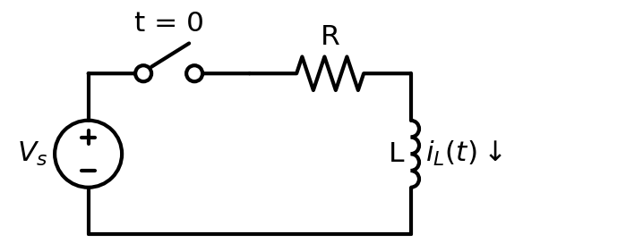

**Recognize it:** an **inductor**, a switch, resistors, a DC source. Asked for `i_L(t)` or `i(t)`.

**COPY THIS TEMPLATE:**
```
STEP 1  t<0: inductor = SHORT (plain wire). Solve DC for the inductor current.
        i_L(0⁻) = ______       →  i_L(0⁺) = i_L(0⁻) = ______   (inductor current can't jump)

STEP 2  t→∞: inductor = SHORT. Solve DC again.
        i_L(∞) = ______

STEP 3  Time constant: turn OFF independent sources. Resistance seen by the inductor:
        R_th = ______          τ = L / R_th = ______ / ______ = ______ s

STEP 4  Plug in:
        i_L(t) = i_L(∞) + [ i_L(0⁺) − i_L(∞) ] e^(−t/τ)
        i_L(t) = ______ + ( ______ − ______ ) e^(−t/ ______ )   A
```
**Need a voltage or another current?** Get it from `v_L = L·di_L/dt`, or from Ohm's/KVL/KCL using `i_L(t)`.
**Worked (Dorf P8.3-25):** read off the plot `v(0⁺)=100, v(∞)=20`, point (0.14s,60) ⇒ `τ=0.2s`, `v(t)=20+80e^(−5t) V`.

---

## TYPE 3 — SECOND-ORDER **SERIES RLC** (R, L, C in one loop)

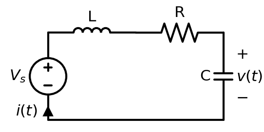  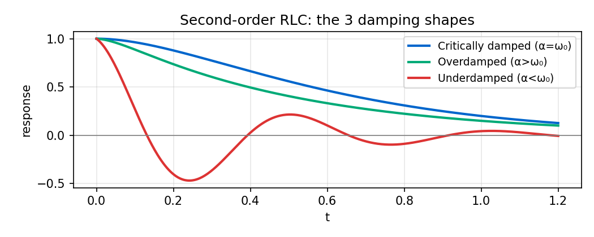

**Recognize it:** **both** an inductor and a capacitor **in a single loop** (after turning off sources). Usually solve for loop current `i(t)`.

**COPY THIS TEMPLATE:**
```
STEP 1  α = R / (2L) = ______            (SERIES: R over 2L)
STEP 2  ω₀ = 1/√(LC) = ______
STEP 3  Characteristic eqn:  s² + (R/L)s + 1/(LC) = 0   →   s² + ____ s + ____ = 0
        Roots:  s = −α ± √(α² − ω₀²) = ______ , ______
STEP 4  Pick the case by comparing α vs ω₀:
        α > ω₀  OVERDAMPED      → x(t) = A₁e^(s₁t) + A₂e^(s₂t)
        α = ω₀  CRITICAL        → x(t) = (A₁ + A₂t) e^(−αt)
        α < ω₀  UNDERDAMPED     → x(t) = e^(−αt)(B₁cos ω_d t + B₂sin ω_d t),  ω_d=√(ω₀²−α²)=____
STEP 5  Add forced part x(∞) if a source stays on;  find the 2 constants from:
        x(0⁺) = ______   and   x'(0⁺) = ______      (x'(0)= i_C(0)/C  or  v_L(0)/L)
```
**Worked (handout P1):** R=40, L=0.1, C=1/3 mF ⇒ α=200, ω₀=173 ⇒ `s²+400s+30000=0`, roots **−100, −300** (overdamped).

---

## TYPE 4 — SECOND-ORDER **PARALLEL RLC** (R, L, C all in parallel)

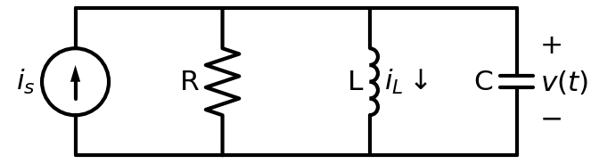

**Recognize it:** inductor and capacitor **side-by-side (parallel)** after turning off sources. Usually solve for node voltage `v(t)`.

**COPY THIS TEMPLATE (only Step 1 changes vs series!):**
```
STEP 1  α = 1 / (2RC) = ______          (PARALLEL: 1 over 2RC)
STEP 2  ω₀ = 1/√(LC) = ______           (same as series)
STEP 3  Characteristic eqn:  s² + (1/RC)s + 1/(LC) = 0   →   s² + ____ s + ____ = 0
        Roots:  s = −α ± √(α² − ω₀²) = ______ , ______
STEP 4–5  same damping cases & constants as TYPE 3.
```
**Worked (handout P3):** R=10, L=½, C=5 mF ⇒ α=10, ω₀=20 ⇒ `s²+20s+400=0`, roots **−10 ± j17.3** (underdamped).

> **DAMPING TRAP:** in **series**, a *large* R is overdamped; in **parallel**, a *small* R is overdamped. (Series: `R>2√(L/C)` over; Parallel: `R<½√(L/C)` over.)

---

## TYPE 5 — DC NETWORK: Thévenin / Norton / Max Power

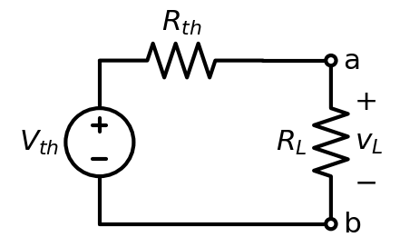

**Recognize it:** "find the equivalent seen by R_L", "max power", or a big resistor network. **Replace everything left of a–b with `V_th` in series with `R_th`.**

**COPY THIS TEMPLATE:**
```
V_th = open-circuit voltage across a–b (remove R_L, find V_oc) = ______
R_th = (turn off independent sources) resistance looking into a–b = ______
       [if dependent sources: R_th = V_oc / I_sc]
Current in a load R:   i = V_th / (R_th + R) = ______
MAX POWER:  happens when R_L = R_th ;   P_max = V_th² / (4 R_th) = ______
```

---

## TYPE 6 — IDEAL OP-AMP

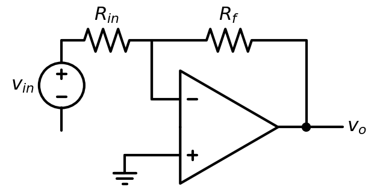

**Recognize it:** a triangle symbol. **Two golden rules:** (1) no current into the inputs `i₊=i₋=0`; (2) `v₊ = v₋` (virtual short).

**COPY THIS TEMPLATE:**
```
Find v₋ (= v₊, often = 0 "virtual ground" if + is grounded).
Write KCL at the inverting (−) node using i₊=i₋=0:
        (v_in − v₋)/R_in = (v₋ − v_o)/R_f
Solve for v_o.
Common results:  Inverting  v_o = −(R_f/R_in) v_in
                 Non-invert v_o = (1 + R_f/R_in) v_in
                 Output current i_o: KCL at the output node.
```
**Worked (your HW2/HW5):** 20kΩ in, 20kΩ → `V_M = −4 V`; `−2 − v_o = 8·3.5` → `v_o = −30 V`.

---

---

## TYPE 7 — TWO-POSITION SWITCH / SOURCE-FREE (natural) transient

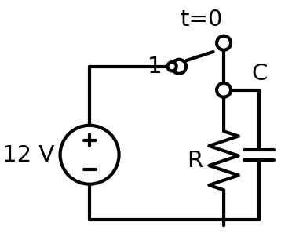  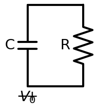

**Recognize it:** switch moves **1→2** at t=0, OR a charged C / energized L is left alone with just R (no source). This is the same first-order machine — the only change is `x(∞)`.

**COPY THIS TEMPLATE:**
```
Position 1 "for a long time" → find the stored state at the instant of switching:
        v_C(0) = ______  (cap charged through pos-1 path, DC)   /   i_L(0) = ______
After switch to position 2 (or source removed):
        If NO source remains:  x(∞) = 0   →   x(t) = x(0) e^(−t/τ)   (pure decay)
        τ = R_th·C  or  L/R_th using the position-2 resistances = ______
Energy released:  W_C = ½ C v_C(0)²   or   W_L = ½ L i_L(0)²  = ______ J
```

---

## TYPE 8 — NORTON & SOURCE TRANSFORMATION

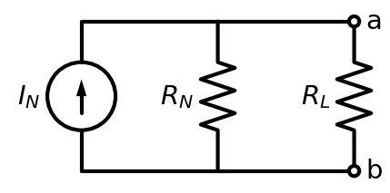

**Recognize it:** "Norton equivalent", or you want to simplify many sources/resistors.

**COPY THIS TEMPLATE:**
```
I_N = short-circuit current across a–b (put a wire on a–b, find i) = ______
R_N = R_th = (independent sources off) resistance into a–b = ______
Norton ⇄ Thévenin:   V_th = I_N · R_th ,   I_N = V_th / R_th ,   R_N = R_th
Source transform:  [V_s in series with R]  ⇄  [I_s = V_s/R in parallel with R]
```

---

## TYPE 9 — OP-AMP VARIANTS

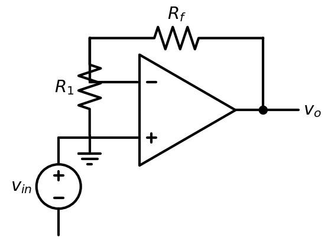  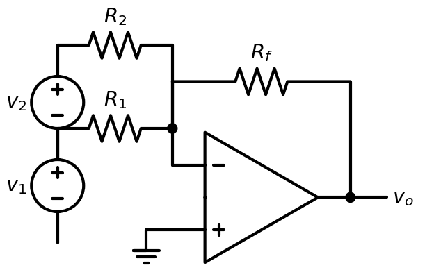

**Golden rules:** `i₊ = i₋ = 0` and `v₊ = v₋`. Then write KCL at the `−` node.
```
Inverting:      v_o = −(R_f/R_in) v_in
Non-inverting:  v_o = (1 + R_f/R_in) v_in
Buffer:         v_o = v_in
Summing:        v_o = −R_f ( v_1/R_1 + v_2/R_2 + … )
Difference:     v_o = (R_f/R_1)(v_2 − v_1)   [matched ratios]
Cascade:        multiply the stage gains
Output limited by supply rails:  V⁻ ≤ v_o ≤ V⁺  (saturation)
```

---

## TYPE 10 — AC STEADY-STATE (phasors)

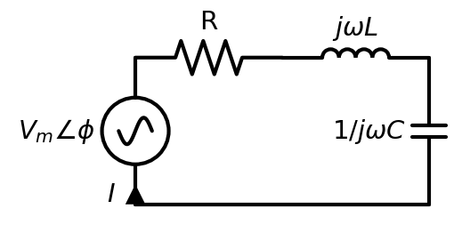

**Recognize it:** a sinusoidal source `V_m cos(ωt+φ)`; asked for steady-state v(t)/i(t).

**COPY THIS TEMPLATE:**
```
1. Source → phasor:  V_m cos(ωt+φ) ⇒ V = V_m ∠φ
2. Elements → impedance at this ω:  Z_R=R,  Z_L=jωL,  Z_C=1/(jωC)=−j/(ωC)
3. Solve like DC but COMPLEX (Ohm V=IZ, dividers, nodal/mesh):
        I = V / Z_total = ______ ∠ ______
4. Back to time domain:  I_m∠θ ⇒ i(t)= I_m cos(ωt+θ)
Complex math:  add/sub in a+jb ; mult/div in r∠θ (mags ×/÷, angles +/−)
```

---

## TYPE 11 — AC POWER & POWER-FACTOR CORRECTION

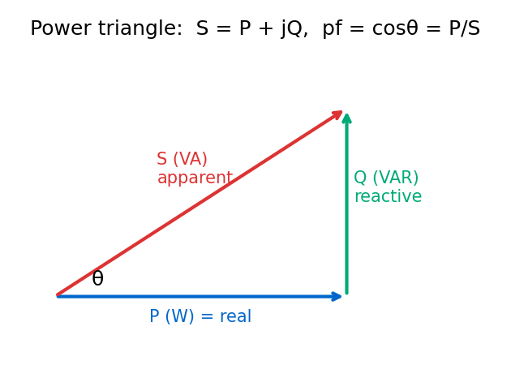

**Use RMS values** (`V_rms = V_m/√2`). With `θ = θ_v − θ_i`:
```
Real    P = V_rms I_rms cosθ   (W)      ← cosθ = power factor (pf)
React.  Q = V_rms I_rms sinθ   (VAR)    (+ inductive/lagging, − capacitive/leading)
Apparent S = V_rms I_rms       (VA)     Complex S = V·I* = P + jQ ;  |S|=√(P²+Q²)
Per element:  P = I_rms²R ,  Q = I_rms²X
PF correction (add parallel C):  Q_C = P(tanθ_old − tanθ_new),  C = Q_C/(ω V_rms²)
```

---

## TYPE 12 — RESONANCE & FILTERS

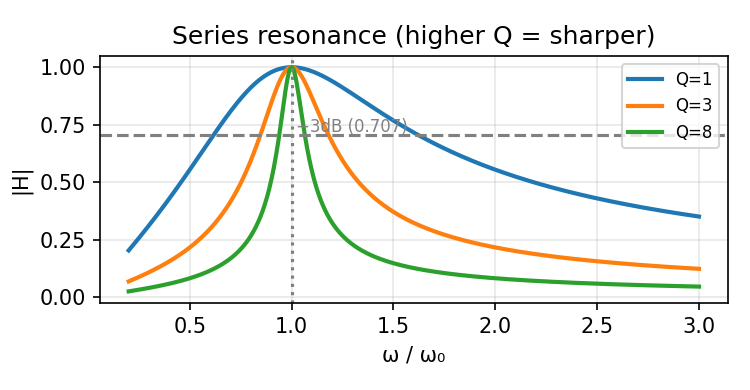  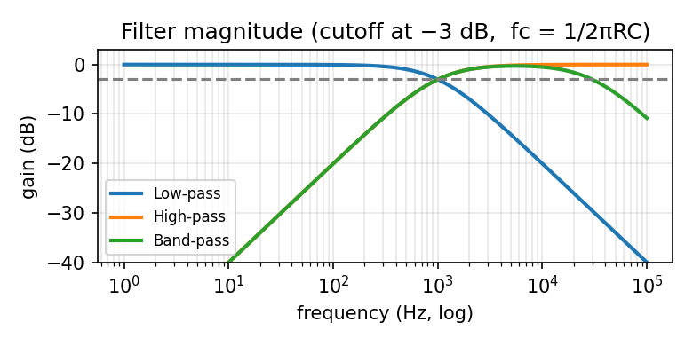

```
Resonance (series RLC): ω₀ = 1/√(LC) ; at ω₀, Z is purely real (=R), current is MAX.
Quality factor:  Q = ω₀L/R = 1/(ω₀RC)        Bandwidth: BW = ω₀/Q
RC filter cutoff:  f_c = 1/(2πRC)   (gain is 0.707 / −3 dB at f_c)
Low-pass: output across C.  High-pass: output across R.  Band-pass: cascade LP+HP.
Band-pass center (geometric mean): f_r = √(f_L · f_H)
```

---

## TYPE 13 — NODAL / MESH (when there's no single divider trick)

```
NODAL (pick when fewer nodes):                 MESH (pick when fewer loops):
1. Ground the bottom node.                      1. Clockwise mesh currents i₁,i₂…
2. Node voltages V₁,V₂…                          2. KVL each mesh; shared R carries (i_this−i_adj)
3. KCL each node: Σ (V_this−V_other)/R = sources 3. Supermesh if a current source is shared
4. Supernode if a V-source links two nodes      4. Solve the linear system
5. Solve the linear system
```

---

## TYPE 14 — DIVIDERS, Δ–Y, & WHEATSTONE BRIDGE

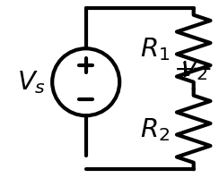  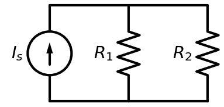  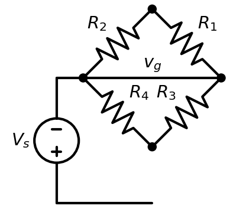

```
Voltage divider (series): v_k = V_s · R_k / ΣR
Current divider (2 parallel): i_1 = i_total · R_2/(R_1+R_2)   (current favors SMALLER R)
Δ→Y:  R_Y = (product of the two adjacent Δ resistors) / (sum of all three Δ resistors)
Y→Δ:  R_Δ = (sum of pairwise products of Y resistors) / (the opposite Y resistor)
Balanced Wheatstone bridge (v_g = 0):  R_1/R_2 = R_3/R_4   (use to find an unknown R)
```

---

## TYPE 15 — CHARGE & ENERGY FROM A GRAPH

```
Charge transferred:  q = ∫ i dt  = AREA under the i–t graph
Energy:              W = ∫ p dt = ∫ v·i dt
Method: break the graph into straight-line pieces; write v(t),i(t) for each interval;
        multiply p=v·i; integrate each interval; add them up.
```

---

*Diagrams generated for this guide; component values are placeholders — drop in your exam's numbers. Full algebra for each worked example is in `WORKED_EXAMPLES.md`; all formulas in `CHEATSHEET.md`.*
